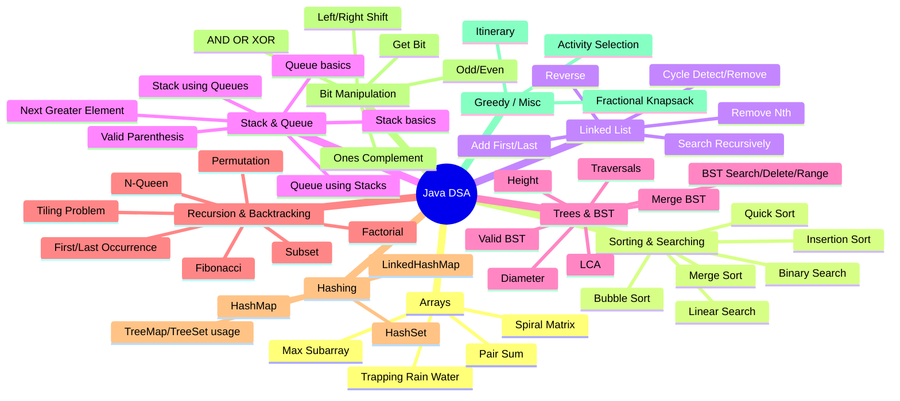

# Java DSA Sheet

Comprehensive Java DSA practice repository for interview preparation.

## What this README includes
- Theory quick revision
- Topic graph (mind map)
- Complexity summary
- Dry run method you can apply to every file
- Detailed dry run examples
- Full Java files index from this repository

---

## 1) How to run files

Use this pattern for any file:

```bash
javac <FileName>.java
java <ClassName>
```

Example:

```bash
javac binarySearch.java
java binarySearch
```

---

## 2) DSA Theory Quick Notes

### Array
- Contiguous memory
- Random access: O(1)
- Middle insert/delete needs shifting

### Linked List
- Node-based dynamic structure
- Head insertion: O(1)
- Search: O(n)

### Stack
- LIFO
- push/pop/peek in O(1)

### Queue
- FIFO
- add/remove/peek

### Hashing
- Average O(1) insert/search/delete
- Collisions handled by chaining/open addressing

### Recursion
- Base case + recursive case
- Uses call stack

### Backtracking
- choose -> recurse -> undo
- Used in N-Queen, permutations, subsets

### Divide and Conquer
- Split problem into smaller subproblems
- Merge Sort, Quick Sort

### BST
- Left < Root < Right
- Average search O(log n), worst O(n)

### Bit Manipulation
- AND, OR, XOR, shifts, bit check/set/clear

---

## 3) Topic Graph (Mind Map)



---

## 4) Complexity Cheat Sheet

| Problem Type | Time | Space |
|---|---:|---:|
| Linear Search | O(n) | O(1) |
| Binary Search | O(log n) | O(1) |
| Bubble Sort | O(n^2) | O(1) |
| Insertion Sort | O(n^2) | O(1) |
| Merge Sort | O(n log n) | O(n) |
| Quick Sort (avg) | O(n log n) | O(log n) |
| Linked List traversal | O(n) | O(1) |
| Stack push/pop | O(1) | O(1) |
| Queue add/remove (ideal) | O(1) | O(1) |
| BST search (avg) | O(log n) | O(h) |
| N-Queen | ~O(n!) | O(n^2) |

---

## 5) Universal Dry Run Template (Use for every file)

For every program, follow this exact template:

1. Write input clearly.
2. Write initial variable state.
3. For each loop/recursion step, update table.
4. Note decision at each `if/else`.
5. Write final output and complexity.

### Dry run table format

| Step | Variables | Condition/Decision | State/Output |
|---:|---|---|---|
| 1 | | | |
| 2 | | | |
| 3 | | | |

---

## 6) Detailed Dry Run Examples

### A) binarySearch.java
Input: `[2,4,6,8,10,14]`, key `10`

| Step | start,end,mid | Check | Action |
|---:|---|---|---|
| 1 | 0,5,2 | arr[2]=6 < 10 | start=3 |
| 2 | 3,5,4 | arr[4]=10 == 10 | return 4 |

### B) bubbleAlgo.java
Input: `[5,4,1,3,2]`

- Pass 1 -> `[4,1,3,2,5]`
- Pass 2 -> `[1,3,2,4,5]`
- Pass 3 -> `[1,2,3,4,5]`

### C) linkedlist.java
Operations: `addFirst(2), addFirst(1), addLast(3), addLast(4)`

- After `addFirst(2)`: `2 -> null`
- After `addFirst(1)`: `1 -> 2 -> null`
- After `addLast(3)`: `1 -> 2 -> 3 -> null`
- After `addLast(4)`: `1 -> 2 -> 3 -> 4 -> null`

### D) mergesort.java
Input: `[6,3,9,5,2,8]`

- Split: `[6,3,9]` + `[5,2,8]`
- Further split until single elements
- Merge sorted parts -> `[2,3,5,6,8,9]`

### E) nqueen.java (n=4)
- Place queen row by row
- Check same column + two diagonals
- If no safe position, backtrack
- Continue until valid board configurations are found

### F) QueueB.java
Added: `1,2,3`

- peek 1, remove -> `[2,3]`
- peek 2, remove -> `[3]`
- peek 3, remove -> `[]`

---

## 7) Full Java Files Index (152 files)

- BSTA.java
- BinaryAnd.java
- BinaryTreeB.java
- HeapB.java
- Matrices.java
- OOPS.java
- OOPS1.java
- OOPS2.java
- OOPS3.java
- QueueB.java
- QueueC.java
- QueuqA.java
- activitysel.java
- addmiddle.java
- anagram.java
- arraylist.java
- binaryGetBit.java
- binaryLeft.java
- binaryOr.java
- binaryRight.java
- binarySearch.java
- binaryXor.java
- binaryoddeven.java
- bottompus.java
- bstDelete.java
- bstRange.java
- bstleafpath.java
- bstmirror.java
- bstsearchkey.java
- bstsorted.java
- bubbleAlgo.java
- changearr.java
- compressionstring.java
- conditions.java
- containsDup.java
- converttobalenceBst.java
- countDistinctel.java
- counttree.java
- detectingcycle.java
- diamtr.java
- digonalSum.java
- duplicateparen.java
- dupstrno.java
- factorial.java
- finditineraryticket.java
- firstnonrepque.java
- firststringuppercase.java
- fractinalKnapsak.java
- friendsPair.java
- getarraylist.java
- grid.java
- hashmapA.java
- hashmapB.java
- hashset.java
- hashsetB.java
- heapA.java
- heapsort.java
- heighttree.java
- inoder.java
- insertheap.java
- insertionAlgo.java
- interleaveque.java
- iterativelinkedlist.java
- kadanceAlgo.java
- largestNumber.java
- largeststring.java
- leveloder.java
- leveltre.java
- linear.java
- linkedhaset.java
- linkedhashmap.java
- linkedlist.java
- linkedlistadd.java
- listcontains.java
- lowcomAnc.java
- main.java
- majorit.java
- maxHistogram.java
- maxSubarray.java
- maxarraylist.java
- mergeBST.java
- mergelinkedlist.java
- mergesort.java
- miltilist.java
- minabsdiffpair.java
- nextgreaterel.java
- nqueen.java
- nrupeswmaxcost.java
- onesComplement.java
- pairarraylist.java
- pairsOfArray.java
- palindrome.java
- postoder.java
- preoder.java
- print1to10.java
- product.java
- purmutatins.java
- queueliklist.java
- queuepopstack.java
- quicksort.java
- rec1Ton.java
- recFibonaci.java
- recNto1.java
- recepowern.java
- recfactorial.java
- recfirstoccerence.java
- reclastoccerence.java
- recnaturalsum.java
- recsorted.java
- refirlinkedlist.java
- remlastlinkedlist.java
- removearraylist.java
- removecycle.java
- removenthnode.java
- reversArray.java
- reversearraylist.java
- reverselinkedlist.java
- reverseofnumber.java
- reverseque.java
- reversestack.java
- searchreclinkedlist.java
- setarraylist.java
- sizearraylist.java
- sizelinkedlist.java
- somOfAorB.java
- sortarraylist.java
- spiral.java
- stackA.java
- stacka1.java
- stockcell.java
- stockspan.java
- storewater.java
- stringbuilder.java
- subArray.java
- subset.java
- substrings.java
- subtre.java
- sumTree.java
- sumoffirstnatural.java
- sw.java
- swaptwonumber.java
- taxcalculator.java
- tempCodeRunnerFile.java
- tillingpriob.java
- trappingRainWater.java
- treehashmap.java
- treesethaset.java
- trivalEwns.java
- unionIntersec.java
- usestack2que.java
- validbst.java
- validparenthesis.java

---

## 8) Interview Answer Script (Short)

For any problem, speak in this order:
1. Brute force idea
2. Optimized approach
3. Dry run on sample input
4. Time complexity `T(n)`
5. Space complexity `S(n)` and edge cases

---

## 9) Next step

If needed, this can be extended to file-by-file individual explanation cards for all 152 files.
